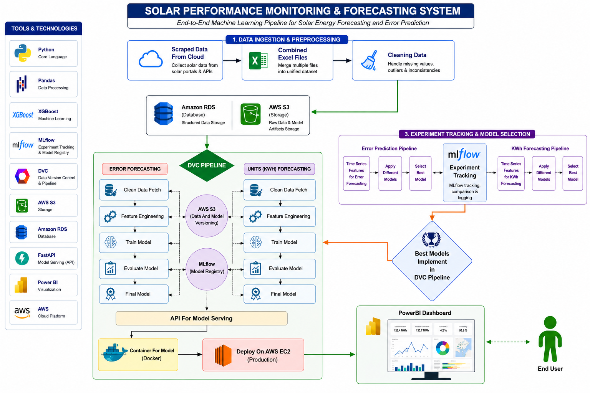

solar-performance-monitoring
==============================

Analyze and monitor solar power plant performance using real-world data to generate actionable insights.

## Table of Contents
- [Overview](#overview)
- [Project Structure](#project-structure)
- [Project RoadMap](#Project-RoadMap)
- [Key Directories](#key-directories)
- [Data Pipeline](#data-pipeline)
- [Machine Learning Models](#machine-learning-models)
- [Getting Started](#getting-started)

## Overview

This project presents an end-to-end MLOps-based system for solar power plant performance monitoring and forecasting. It leverages real-world data to deliver accurate energy output (KWh) predictions and error forecasting, enabling data-driven decision-making and operational efficiency.

The solution integrates the complete machine learning lifecycle, including data ingestion, preprocessing, feature engineering, model development, evaluation, and deployment. It supports scalable and reproducible workflows using modern tools for data versioning, experiment tracking, and model management.
the system provides actionable insights to optimize solar energy generation, detect potential system failures, and enhance overall plant performance.

## Project Structure

    ├── README.md                          <- The top-level README for developers using this project.
    ├── dvc.yaml                           <- DVC pipeline configuration file.
    ├── params.yaml                        <- Model parameters and configuration settings.
    ├── requirements.txt                   <- Python dependencies for the project.
    │
    ├── accuracy_report/                   <- Model performance metrics and reports.
    │   ├── error_matrics/
    │   │   └── metrics_error.json         <- Error model evaluation metrics.
    │   └── kwh_matrics/
    │       └── metrics_kwh.json           <- KWh model evaluation metrics.
    │
    ├── data/                              <- All data files and datasets.
    │   ├── date_pointer.txt               <- Current data processing date pointer.
    │   ├── interim/                       <- Intermediate data after initial transformations.
    │   │   ├── Fetch_join_data/           <- Raw fetched and joined data.
    │   │   │   ├── error_data.csv
    │   │   │   └── unit_data.csv
    │   │   └── Preprocessing_data/        <- Preprocessed data files.
    │   │       ├── df_error.csv
    │   │       └── df_unit.csv
    │   ├── processed/                     <- Final processed datasets ready for modeling.
    │   │   ├── cleaned_data/              <- Cleaned and consolidated data.
    │   │   │   └── final_data_forecasting.csv
    │   │   └── feature_data/              <- Feature-engineered datasets.
    │   │       ├── error_data/
    │   │       │   └── feature_engineered_data_error.csv
    │   │       └── kwh_data/
    │   │           └── feature_engineered_data_kwh.csv
    │   ├── raw/                           <- Original, immutable data dumps.
    │   │   ├── error_files/               <- Raw error data files.
    │   │   └── unit_files/                <- Raw unit/performance data files.
    │   └── train_test_data/               <- Split datasets for model training and testing.
    │       ├── train_test_error/          <- Error prediction datasets.
    │       │   ├── X_test.csv
    │       │   ├── X_train.csv
    │       │   ├── y_test.csv
    │       │   └── y_train.csv
    │       └── train_test_kwh/            <- KWh forecasting datasets.
    │           ├── X_test.csv
    │           ├── X_train.csv
    │           ├── y_test.csv
    │           └── y_train.csv
    │
    │
    ├── models/                            <- Trained and serialized models.
    │   ├── final_model/                   <- Final production-ready models.
    │   │   ├── error_model/               <- Trained error prediction model.
    │   │   └── kwh_model/                 <- Trained KWh forecasting model.
    │   └── train_model/                   <- Intermediate/experimental models.
    │       ├── error_model/               <- Error model training artifacts.
    │       └── kwh_model/                 <- KWh model training artifacts.
    │
    ├── notebooks/                         <- Jupyter notebooks for analysis and experimentation.
    │   ├── 01_webscraping(logs).ipynb     <- Web scraping and data collection from logs.
    │   ├── 02_data_joining.ipynb          <- Data merging and alignment.
    │   ├── 03_Exploratory_data_analysis.ipynb <- Data exploration and visualization.
    │   ├── 04_Kwh_models.ipynb             <- Machine learning model development.
    │   ├── 05_data_Transformation.ipynb   <- Data transformation and preprocessing.
    │   ├── 06_feature_unit_forceast.ipynb <- Feature engineering for unit forecasting.
    │   ├── 07_test_coding.ipynb           <- Testing and debugging notebook.
    │   └── 08_error_models.ipynb                 <- Error Model Experiment and investigation.
    │
    └── src/                               <- Source code for use in this project.
        ├── __init__.py                    <- Makes src a Python module.
        │
        ├── data/                          <- Scripts for data fetching and transformation.
        │   ├── data_fetching_and_joining.py     <- Fetch and merge raw data.
        │   ├── data_Transformation_cleaning.py  <- Clean and transform data.
        │   └── final_data_forecasting.py        <- Prepare final forecasting datasets.
        │
        ├── features/                      <- Scripts for feature engineering.
        │   ├── feature_engineering_error.py     <- Error model features.
        │   └── feature_engineering_kwh.py       <- KWh forecasting features.
        │
        ├── models/                        <- Scripts for model training and prediction.
        │   ├── __init__.py
        │   ├── 1_0_train_test_split_kwh.py      <- Split KWh data for training.
        │   ├── 1_1_train_model_kwh.py           <- Train KWh forecasting model.
        │   ├── 1_2_model_Performence_kwh.py     <- Evaluate KWh model performance.
        │   ├── 1_3_train_model_full_data_kwh.py <- Train final KWh model on full data.
        │   ├── 1_4_model_registry.py            <- Model versioning and registry.
        │   ├── 2_0_train_test_split_error.py    <- Split error data for training.
        │   ├── 2_1_train_model_error.py         <- Train error prediction model.
        │   ├── 2_2_model_Performence_error.py   <- Evaluate error model performance.
        │   ├── 2_3_train_model_full_data_error.py <- Train final error model on full data.
        │   └── 2_4_predict_model_error.py       <- Generate error predictions.
        │
        ├── utils/                         <- Utility functions and helpers.
        │   ├── __init__.py
        │   └── mlflow_setup.py            <- MLflow configuration and logging setup.
        │
        └── visualization/                 <- Scripts for data visualization and reporting.


--------
## Project RoadMap

<p align="center">
  
  <br>
  <em>Figure: Project Directries</em>
</p>


## Key Directories

### Root Configuration Files
- **dvc.yaml** - Data Version Control pipeline configuration that defines the workflow steps, dependencies, and outputs
- **params.yaml** - Model hyperparameters and configuration settings used across the project
- **pipelne.txt** - Pipeline documentation and execution notes
- **requirements.txt** - Python package dependencies for the project
- **README.md** - Project documentation

### Data Directory (`data/`)
Contains all data at different stages of processing:

#### Raw Data (`data/raw/`)
- **error_files/** - Original error logs and error-related data from solar equipment
- **unit_files/** - Original unit performance data and system metrics

#### Interim Data (`data/interim/`)
Intermediate processing stages:
- **Fetch_join_data/** - Initial fetched and joined data from sources
  - error_data.csv - Joined error information
  - unit_data.csv - Joined unit information
- **Preprocessing_data/** - Data after initial cleaning and preprocessing
  - df_error.csv - Preprocessed error data
  - df_unit.csv - Preprocessed unit data

#### Processed Data (`data/processed/`)
Final datasets ready for modeling:
- **cleaned_data/** - Consolidated and cleaned final dataset
  - final_data_forecasting.csv - Complete merged dataset for all modeling tasks
- **feature_data/** - Feature-engineered datasets by prediction task
  - error_data/ - Features engineered for error prediction
    - feature_engineered_data_error.csv
  - kwh_data/ - Features engineered for KWh forecasting
    - feature_engineered_data_kwh.csv

#### Train-Test Splits (`data/train_test_data/`)
Separated training and testing datasets:
- **train_test_error/** - Error prediction datasets
  - X_train.csv, X_test.csv - Feature sets
  - y_train.csv, y_test.csv - Target labels
- **train_test_kwh/** - KWh forecasting datasets
  - X_train.csv, X_test.csv - Feature sets
  - y_train.csv, y_test.csv - Target values

#### Metadata
- **date_pointer.txt** - Tracks current processing date for incremental updates

### Notebooks Directory (`notebooks/`)
Jupyter notebooks documenting the analysis workflow:
1. **01_webscraping(logs).ipynb** - Web scraping and data collection from solar equipment logs
2. **02_data_joining.ipynb** - Merging multiple data sources and alignment
3. **03_Exploratory_data_analysis.ipynb** - Data exploration, statistics, and visualization
4. **04_ML_models.ipynb** - Machine learning model experimentation and comparison
5. **05_data_Transformation.ipynb** - Data cleaning, normalization, and transformation
6. **06_feature_unit_forceast.ipynb** - Feature engineering techniques for unit forecasting
7. **07_test_coding.ipynb** - Testing and debugging of data processing code
8. **08_error.ipynb** - Error analysis and investigation of anomalies

### Source Code Directory (`src/`)
Reusable Python modules and scripts organized by functionality:

#### Data Module (`src/data/`)
Data fetching and preprocessing pipeline:
- **data_fetching_and_joining.py** - Retrieves raw data from sources and joins multiple datasets
- **data_Transformation_cleaning.py** - Cleans data, handles missing values, removes outliers
- **final_data_forecasting.py** - Prepares consolidated datasets for modeling

#### Features Module (`src/features/`)
Feature engineering for predictive modeling:
- **feature_engineering_error.py** - Creates features for error prediction models (derives predictive indicators from error patterns)
- **feature_engineering_kwh.py** - Creates features for KWh forecasting models (derives energy output predictors)

#### Models Module (`src/models/`)
Model training, evaluation, and prediction pipeline:

**KWh Forecasting Pipeline:**
- **1_0_train_test_split_kwh.py** - Splits KWh data into training and testing sets
- **1_1_train_model_kwh.py** - Trains KWh forecasting model with optimization
- **1_2_model_Performence_kwh.py** - Evaluates KWh model performance on test data
- **1_3_train_model_full_data_kwh.py** - Trains final KWh model on complete dataset for production

**Error Prediction Pipeline:**
- **2_0_train_test_split_error.py** - Splits error data into training and testing sets
- **2_1_train_model_error.py** - Trains error prediction model
- **2_2_model_Performence_error.py** - Evaluates error model performance
- **2_3_train_model_full_data_error.py** - Trains final error model on complete dataset

**Model Management:**
- **1_4_model_registry.py** - Manages model versioning, registry, and lifecycle
- **2_4_predict_model_error.py** - Generates predictions using trained error models

#### Utils Module (`src/utils/`)
Utility functions and helper modules:
- **mlflow_setup.py** - MLflow configuration for experiment tracking and model logging
- **__init__.py** - Package initialization

#### Visualization Module (`src/visualization/`)
Scripts for creating charts, graphs, and visual reports of model results

### Models Directory (`models/`)
Trained and serialized model artifacts:

#### Final Models (`models/final_model/`)
Production-ready models trained on full dataset:
- **error_model/** - Trained error prediction model for deployment
- **kwh_model/** - Trained KWh forecasting model for deployment

#### Training Models (`models/train_model/`)
Intermediate models and training artifacts:
- **error_model/** - Error model training checkpoints and intermediate versions
- **kwh_model/** - KWh model training checkpoints and intermediate versions


### Accuracy Reports Directory (`accuracy_report/`)
Model performance metrics and evaluation results:
- **error_matrics/**
  - metrics_error.json - Error model evaluation metrics (accuracy, precision, recall, F1-score, etc.)
- **kwh_matrics/**
  - metrics_kwh.json - KWh model evaluation metrics (MAE, RMSE, R², etc.)

## Data Pipeline

1. **Collection** → Raw data from solar equipment logs (`data/raw/`)
2. **Joining** → Merge error and unit data (`data/interim/Fetch_join_data/`)
3. **Preprocessing** → Clean and normalize (`data/interim/Preprocessing_data/`)
4. **Consolidation** → Create unified dataset (`data/processed/cleaned_data/`)
5. **Feature Engineering** → Create predictive features (`data/processed/feature_data/`)
6. **Train-Test Split** → Prepare modeling datasets (`data/train_test_data/`)
7. **Modeling** → Train and evaluate models (`models/`)


## Machine Learning Models

### Two-Model Approach

**KWh Forecasting Model**
- Predicts solar energy output (kilowatt-hours)
- Uses time-series features and environmental data
- Regression task with continuous output
- Outputs stored in `Forecasting/kwh/kwh_predictions.csv`

**Error Prediction Model**
- Detects and predicts system errors and anomalies
- Identifies potential equipment failures
- Classification or regression task depending on error type
- Outputs stored in `Forecasting/error/`

### Model Lifecycle

1. Train-test split on prepared data
2. Model training with hyperparameter optimization
3. Performance evaluation on test set
4. Metrics logging and tracking
5. Final model training on full dataset
6. Model registry and versioning
7. Prediction generation for new data

## Getting Started

### Installation
```bash
pip install -r requirements.txt
```

### Configuration
- Update `params.yaml` with model parameters
- Configure `dvc.yaml` for pipeline execution
- Check `pipelne.txt` for workflow documentation

### Running the Pipeline
```bash
# Execute DVC pipeline
dvc repro

# Run specific notebooks in order
jupyter notebook notebooks/01_webscraping\(logs\).ipynb
jupyter notebook notebooks/02_data_joining.ipynb
# ... continue through notebook sequence
```

### Using Trained Models
- Load models from `models/final_model/`
- Use predictions in `Forecasting/` directory
- Check accuracy reports in `accuracy_report/`

## API Endpoints

The project includes a modular FastAPI server for generating solar forecasts. Simply specify the number of days and the API handles all feature engineering automatically.

### Quick Start
```bash
cd api
pip install -r requirements.txt
python main.py
```

The API runs on `http://localhost:8000` with interactive documentation at `/docs`

### Available Endpoints

#### Forecasting Endpoints
- **POST** `/kwh/forecast` - KWh energy forecast (rounded to 2 decimals)
  - Request: `{"days": 7}`
  - Returns: List of date-prediction pairs for N days
  
- **POST** `/error/forecast` - Error prediction forecast (rounded to integers)
  - Request: `{"days": 14}`
  - Returns: List of date-error pairs for N days

#### Info & Health Endpoints
- **GET** `/health` - Check API and model status
- **GET** `/kwh/model-info` - Get KWh model details
- **GET** `/error/model-info` - Get error model details
- **GET** `/docs` - Interactive API documentation (Swagger UI)

### Example Usage

**KWh Forecast:**
```bash
curl -X POST "http://localhost:8000/kwh/forecast" \
  -H "Content-Type: application/json" \
  -d '{"days": 7}'
```

**Response:**
```json
{
  "forecast": [
    {"date": "2025-01-15T00:00:00", "prediction": 95.32},
    {"date": "2025-01-16T00:00:00", "prediction": 96.15},
    {"date": "2025-01-17T00:00:00", "prediction": 94.78}
  ],
  "days": 7,
  "message": "KWH forecast generated successfully for 7 days"
}
```

**Error Forecast:**
```bash
curl -X POST "http://localhost:8000/error/forecast" \
  -H "Content-Type: application/json" \
  -d '{"days": 14}'
```

### How Forecasting Works
1. Load historical data from CSV
2. Calculate 9 engineered features automatically:
   - Temporal features (month encoding, lags, differences)
   - Rolling window statistics (mean, max, min)
   - Feature interactions
3. Predict next day using trained XGBoost model
4. Recursively forecast N days ahead
5. Return predictions with dates

### Configuration
Update environment variables in `api/.env`:
```env
# MLflow connection for model management
repo_owner=YOUR_GITHUB_USERNAME
repo_name=YOUR_REPO_NAME
set_tracking_uri=https://dagshub.com/YOUR_USERNAME/YOUR_REPO.mlflow

# Data file paths (optional, defaults to workspace data)
KWH_DATA_PATH=/path/to/data.csv
ERROR_DATA_PATH=/path/to/data.csv
```
## 👨‍💻 Author  

**Kamran Khan Orakzai**  
Data Science Student | Machine Learning & MLOps Enthusiast  

- 🌐 [GitHub](https://github.com/kamrankhanorakzai)  
- 💼 [LinkedIn](https://www.linkedin.com/in/kamran-khan-orakzai-61463b232/)  
- 📧 [Email](mailto:turababu980@gmail.com)  
--------
